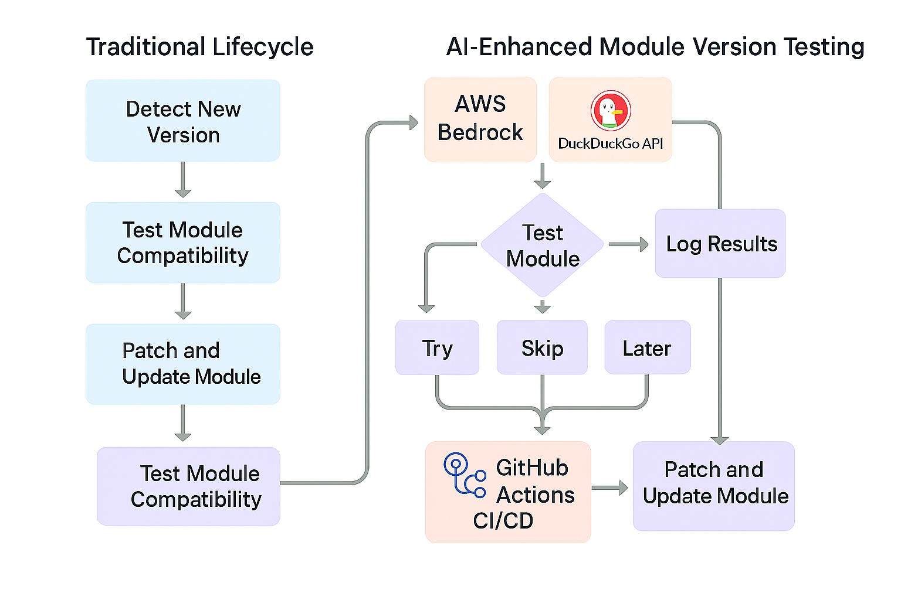

# Terraform AI Patcher PoC

This repository contains a proof-of-concept for AI-powered automation of Terraform module patching
based on the latest Terraform CLI and AWS provider releases.

## Features

- Fetch latest Terraform and AWS provider versions
- Search provider changelogs using DuckDuckGo
- Analyze Terraform plan output with Claude AI (AWS Bedrock)
- Auto-apply recommended patches to Terraform modules
- Commit and tag changes automatically via GitHub Actions

## Usage

1. Configure AWS Bedrock credentials and permissions.
2. Run the GitHub Actions workflow or execute scripts manually.
3. Review patched modules and test in lower environments before production rollout.

---

## Disclaimer

This is a prototype for demonstration purposes only.
